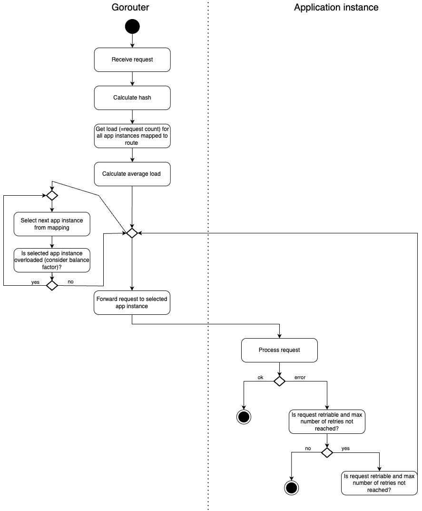

# Meta
[meta]: #meta
- Name: Hash-based routing
- Start Date: 2025-04-07
- Author(s): b1tamara
- Status: Draft <!-- Acceptable values: Draft, Approved, On Hold, Superseded -->
- RFC Pull Request: (fill in with PR link after you submit it)


## Summary

Cloud Foundry uses `round-robin` and `least-connection` algorithms for load balancing between Gorouters and backends. Still, 
they are unsuitable for specific use cases, prompting a proposal to introduce hash-based routing on a per-route basis to 
enhance load distribution in particular scenarios.

## Motivation

Cloud Foundry offers two load balancing algorithms to manage request distribution between Gorouters and backends.
The round-robin algorithm ensures an even distribution of load across all available backends, and the least-connection 
algorithm optimizes resource utilization by directing traffic to the backend with the fewest active connections. A recent 
enhancement allows these load balancing algorithms to be configured on the application route level.

However, these existing algorithms are not ideal for scenarios that require routing based on a tenant or other specific 
identifiers.

An example scenario: users from different tenants send requests to application instances that establish connections to 
tenant-specific databases. With the current load balancing algorithms, each tenant eventually creates a connection to each 
application instance, which then creates connection pools to every customer database. As a result, all tenants might span 
up a full mesh, leading to too many open connections to the customer databases, impacting performance. This limitation 
represents a gap in achieving optimal load distribution and can be solved with routing based on a tenant.

## Proposal

We propose introducing hash-based routing as a load balancing algorithm for use on a per-route basis. This algorithm optimizes 
load distribution and addresses the issues described in the earlier scenario.

The approach leverages an HTTP header, which is associated with each incoming request. The header contains the ID of a 
tenant from which the request was sent. The tenant ID is used to compute a hash value, which will serve as the basis for 
routing decisions. This hash value determines the appropriate application instance for each request, ensuring that all 
requests from a particular tenant are consistently routed to the same instance. Consequently, this load balancing algorithm 
effectively minimizes database connection overhead and optimizes connection pooling, enhancing efficiency and system performance.

### Limitations

#### Only Application Per-Route Load Balancing
The hash-based load balancing will be configured exclusively as an application per-route option and will not be available as a global setting.

#### Consistent Hashing
The implementation will support only consistent hashing. Consistent hashing minimizes the need for rehashing, particularly when the number of application instances varies over time. 

N hashes can be associated with one application instance. The number of hashes is a multiple of the number of application instances. [Maglev hashing](https://storage.googleapis.com/gweb-research2023-media/pubtools/2904.pdf) can be considered as a possible solution.

#### Considering a Balance Factor
Before routing a request, the current load on each application instance must be evaluated using a balance factor. This load is measured by the number of in-flight requests. For example, with a balance factor of 150, no application instance should exceed 150% of the average load across all instances. Consequently, requests must be distributed to different application instances that are not overloaded.

Example:

| Application instance | Current request count	 | Request count / average load |
|----------------------|------------------------|------------------------------|
| app_instance1        | 10                     | 20%                          |
| app_instance2        | 50                     | 100%                         |
| app_instance3        | 90                     | 180%                         |

Based on the average load of 50 requests, new requests to `app_instance3` must be distributed to different application instances that are not overloaded.

The possible values for the balance factor are between 100 and 200. Setting the balance factor to 0 disables consideration of the load situation.

#### Deterministic handling of overflow traffic to the next application instance
The application instance is considered overloaded when the current request load of this application exceeds the balance factor. Overflow traffic should always be directed to the same next instance rather than to a random one.

### Required Changes

#### Gorouter
- The Gorouter MUST be extended to take a regular sample expression via request header
- The Gorouter MUST implement a new `EndpointIterator` to calculate hash, based on the provided header 
- The Gorouter MUST consider consistent hashing 
- The Gorouter SHOULD locally cache the computed hash values to avoid expensive recalculations for each request for which 
hash-based routing should be applied
- The Gorouters SHOULD NOT implement a shared hash cache
- The Gorouter MUST assess the current request load across all application instances mapped to a particular route in order to prevent overload situations

Activity diagram for routing decision for an incoming request:



#### Cloud Controller
The load balancing property of the [route object](https://v3-apidocs.cloudfoundry.org/version/3.190.0/index.html#the-route-options-object) 
MUST be extended to allow `hash:<header>:<balance-factor>` as well `hash:<header>` as valid values:

```bash
version: 1
applications:
- name: test
  routes:
  - route: test.example.com
    options:
      loadbalancing: hash:x-tenant-id:150
  - route: anothertest.example.com
    options:
      loadbalancing: hash:x-tenant-id
```

#### CF cli
- The `create-route`, `update-route`, `map-route` commands MUST be modified to allow the setting of the new load balancing algorithm.
```bash
cf create-route MY-APPexample.com --hostname test --option loadbalancing=hash:x-tenant-id:150
cf update-route MY-APP example.com --hostname test --option loadbalancing=hash:x-tenant-id:150
cf map-route MY-APP example.com --hostname test --option loadbalancing=hash:x-tenant-id:150
```
- The column options of the `routes`, `route` commands MUST be updated to display the new load balancing algorithm.

